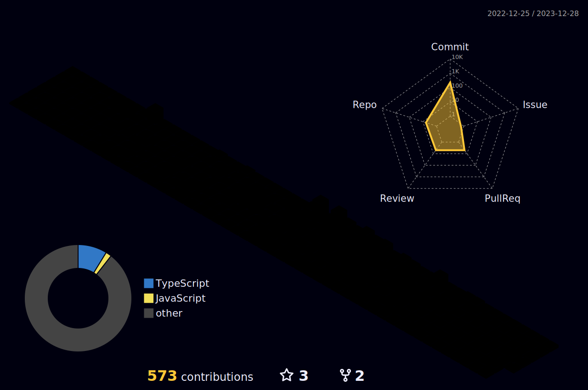

### I'm Nguyen Quoc Nghiep - Asta Nguyen

👋 Greetings! I'm a versatile Full Stack Web Developer who also enjoys crafting Mobile Cross Platform applications. I've worked as Full Stack Web Developer at [VN Digitech Solution][Vndigitech], where I sharpened my skills in building robust and innovative web solutions. Presently, I'm an enthusiastic software engineer at [NUS Technology][Nus], continuously expanding my knowledge and proficiency.

If you're interested in discussing exciting development opportunities or simply want to connect with fellow developers, feel free to reach out! Let's embark on this journey of innovation and technology together.

<!-- ### Mp3 Playing 🎧
 -->

### Connect with me:

[][website]
[][linkedin]
 
 

### Languages:

[][JS]
[][TYPESCRIPT]
[][HTML]
[][CSS]
[][SCSS]
[][Dart]
[][Ruby]
 
 

### Frameworks and libraries:

[][REACT]
[][Angular]
[][Vue]
[][Nextjs]
[][Express]
[][Nestjs]
[][Adonisjs]
[][RAILS]
[][Flutter]
[][ReactNative]
[][Ionic]
 
 

### The editor that I like:

[][Nvim]
[][Vscode]
 
 

### Databases:

[][SQL]
[][MYSQL]
[][MONGO]
[][Postgresql]
 
 

### Other tools:

[][Docker]
[][GIT]
[][GITHUB]
[][TERMINAL]
[][UBUNTU]
 
 

### Other Services:

[][AWS]
[][Google]
 
 

 
 

<!-- ---
### 📺 Several channels and articles to which I refer to learn technical

- [WebDevSimplified](https://www.youtube.com/@WebDevSimplified)
- [Devaslife](https://www.youtube.com/c/devaslife)
- [Daily.dev](https://daily.dev/)
- [Codedamn](https://www.youtube.com/@codedamn)
- [CleverProgrammer](https://www.youtube.com/@CleverProgrammer)
- [CodingGarden](https://www.youtube.com/@CodingGarden)
- [Developedbyed](https://www.youtube.com/@developedbyed)
- [DevonCrawford](https://www.youtube.com/@DevonCrawford)
--- -->

<!-- ### 
:zap: Github Stats
 -->
<!-- <picture>
  <source
    srcset="https://github-readme-stats.vercel.app/api?username=astadk&show_icons=true&theme=dark"
    media="(prefers-color-scheme: dark)"
  />
  <source
    srcset="https://github-readme-stats.vercel.app/api?username=astadk&show_icons=true"
    media="(prefers-color-scheme: light), (prefers-color-scheme: no-preference)"
  />
  
</picture> -->

 
 

---

### 
:zap: Top languages

 
 

---

### My Contrib

[website]: https://www.facebook.com/asta.nguyen.520/
[linkedin]: https://www.linkedin.com/in/nghiepnguyen520/
[Nextjs]: https://nextjs.org
[Nestjs]: https://nestjs.com
[Flutter]: https://flutter.dev/?gclid=CjwKCAjwkdL6BRAREiwA-kiczKjXJgHLgADsqlfFRwp4br1yL6vZbQP3_b89adg3taYxSVS0nSH_9xoCg7UQAvD_BwE&gclsrc=aw.dso
[Nvim]: https://neovim.io
[Vscode]: https://code.visualstudio.com
[HTML]: https://vi.wikipedia.org/wiki/HTML
[CSS]: https://sass-lang.com/guide
[SCSS]: https://sass-lang.com/guide
[JS]: https://www.w3schools.com/js/
[SQL]: https://www.w3schools.com/js/
[MYSQL]: https://www.w3schools.com/js/
[MONGO]: https://www.w3schools.com/js/
[REACT]: https://reactjs.org
[NODE]: https://nodejs.org/en/
[UBUNTU]: https://ubuntu.com
[GIT]: https://github.com/nghiepnguyen520
[GITHUB]: https://github.com/nghiepnguyen520
[TERMINAL]: https://github.com/nghiepnguyen520

[RAILS]: https://github.com/nghiepnguyen520](https://rubyonrails.org/
[TYPESCRIPT]: https://github.com/nghiepnguyen520](https://www.typescriptlang.org/
[Dart]: https://dart.dev/
[Ruby]: https://www.ruby-lang.org/vi/
[AWS]: https://aws.amazon.com/
[Google]: https://cloud.google.com/
[Postgresql]: https://www.postgresql.org/
[Angular]: https://angular.io/
[Vue]: https://vuejs.org/
[Express]: https://expressjs.com/
[Adonisjs]: https://adonisjs.com/
[ReactNative]: https://reactnative.dev/
[Ionic]: https://ionicframework.com/
[Docker]: https://www.docker.com
[Nus]: https://www.nustechnology.com/
[Vndigitech]: https://vndigitech.com/en/
