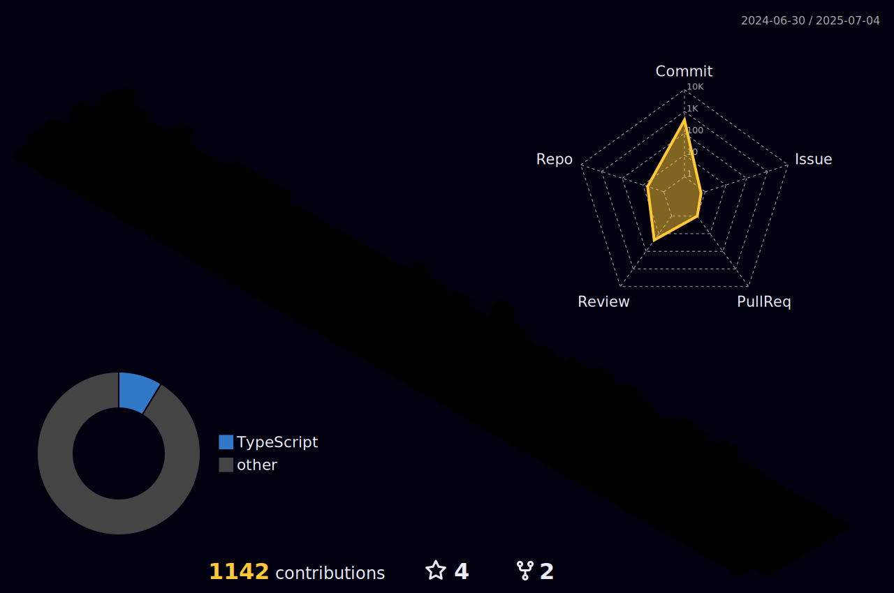

<h1 align="center">
👋 Greetings! I'm Asta Nguyen 
</h1>

 I'm a versatile Full Stack Web Developer who also enjoys crafting Mobile Cross Platform applications. I've worked as Full Stack Web Developer at <a href="https://vndigitech.com/en/">VN Digitech Solution</a>, where I sharpened my skills in building robust and innovative web solutions. Presently, I'm an enthusiastic software engineer at <a href="https://www.nustechnology.com/">NUS Technology</a>, continuously expanding my knowledge and proficiency.

 If you're interested in discussing exciting development opportunities or simply want to connect with fellow developers, feel free to reach out! Let's embark on this journey of innovation and technology together. 

  

### Connect with me

### Languages

### Frameworks and libraries

### Editors

### Databases

### Other Tools

### Other Services

<!-- ### 
:zap: Github Stats
 -->
<!-- <picture>
  <source
    srcset="https://github-readme-stats.vercel.app/api?username=astadk&show_icons=true&theme=dark"
    media="(prefers-color-scheme: dark)"
  />
  <source
    srcset="https://github-readme-stats.vercel.app/api?username=astadk&show_icons=true"
    media="(prefers-color-scheme: light), (prefers-color-scheme: no-preference)"
  />
  
</picture> -->

<!-- ### 
:zap: Top languages

 
 

--- -->
  

  

    
  

### Statistics

### My Contribute

[Nus]: https://www.nustechnology.com/
[Vndigitech]: https://vndigitech.com/en/
